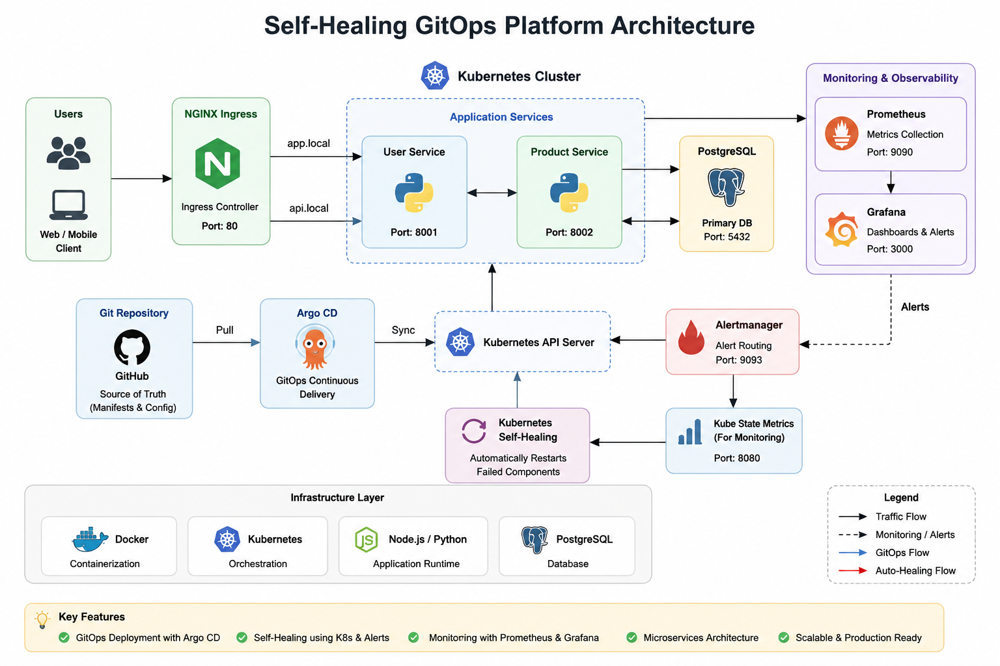

# 🚀 Production-Ready Cloud-Native Self-Healing GitOps Platform with Helm

> A production-inspired cloud-native microservices platform built using **FastAPI, Docker, Kubernetes, Helm, PostgreSQL, Prometheus, Grafana, GitHub Actions, and Argo CD**, demonstrating containerized application deployment, Kubernetes orchestration, Helm-based application packaging, self-healing capabilities, observability, and GitOps-driven deployment.

---

# 📖 Project Overview

Modern cloud-native applications require **high availability, scalability, resiliency, automation, and observability**. Managing distributed applications manually becomes increasingly difficult as systems grow in complexity.

This project demonstrates how to build, package, deploy, and monitor a **production-inspired cloud-native microservices platform** using modern DevOps and Kubernetes technologies.

The platform consists of independent FastAPI microservices running in Docker containers and orchestrated by Kubernetes. Kubernetes provides service discovery, scaling, networking, and self-healing, while Helm packages the application into reusable deployment templates. GitHub Actions provides CI automation, Argo CD enables GitOps-ready deployments, and Prometheus with Grafana deliver observability and monitoring.

Each microservice can be independently deployed, monitored, scaled, and recovered without impacting other services.

The project demonstrates practical implementation of:

- Cloud-Native Microservices
- Docker Containerization
- Docker Compose
- Kubernetes Orchestration
- Helm Package Management
- Kubernetes Self-Healing
- Service Discovery
- Configuration Management
- Kubernetes Secrets
- NGINX Ingress Routing
- GitHub Actions CI
- GitOps Architecture
- Monitoring & Observability
- Production Deployment Practices

---

# 🏗️ Solution Architecture

```text
                          Developer

                              │
                              ▼

                     GitHub Repository

                              │
                              ▼

                    GitHub Actions (CI)

                              │
                              ▼

                     Docker Image Build

                              │
                              ▼

                       Docker Compose

                              │
                              ▼

                         Helm Charts

                              │
                              ▼

                     Kubernetes Cluster

        ┌──────────────────────────────────────┐
        │                                      │
        │      Kubernetes Control Plane        │
        │                                      │
        └──────────────────────────────────────┘

                │                     │

                ▼                     ▼

        User Service          Product Service

                │                     │

                └───────────┬──────────┘

                            ▼

                     PostgreSQL Database

                            │

                            ▼

              ConfigMap & Kubernetes Secrets

                            │

                            ▼

                   Kubernetes Services

                            │

                            ▼

                 NGINX Ingress Controller

                            │

                            ▼

                    Prometheus Monitoring

                            │

                            ▼

                    Grafana Dashboards
```

---

# ✨ Key Features

## ✅ Cloud-Native Microservices

- Independent User Service
- Independent Product Service
- RESTful APIs
- FastAPI framework
- Modular architecture

---

## ✅ Containerization

- Dockerized microservices
- Lightweight Python images
- Multi-container deployment
- Docker Compose integration

---

## ✅ Kubernetes Orchestration

- Kubernetes Deployments
- ReplicaSets
- ClusterIP Services
- ConfigMaps
- Kubernetes Secrets
- NGINX Ingress

---

## ✅ Helm Package Management

- Reusable Helm Charts
- Configurable deployments using values.yaml
- Helm templating
- Helm install
- Helm upgrade
- Helm rollback

---

## ✅ Continuous Integration

GitHub Actions automates project validation.

Current workflow includes:

- Source code checkout
- Python environment setup
- Dependency installation
- CI workflow execution

---

## ✅ High Availability

Multiple replicas provide high availability and fault tolerance.

Example:

- User Service → Multiple Pods
- Product Service → Multiple Pods

---

## ✅ Self-Healing

If a running Pod is deleted or fails:

- Kubernetes detects the failure
- Automatically creates a replacement Pod
- Maintains the desired replica count

---

## ✅ Observability

Application monitoring is implemented using:

- Prometheus
- Grafana
- Kubernetes Metrics
- Pod Monitoring
- Cluster Monitoring

---

## ✅ Production-Oriented Design

The platform follows production-inspired engineering practices:

- Stateless Microservices
- Independent Scaling
- Service Isolation
- Configuration Management
- Infrastructure Separation
- Declarative Kubernetes Resources
- GitOps-ready architecture

---

# ☁️ Technology Stack

| Category | Technologies |
|-----------|--------------|
| Backend | FastAPI, Python |
| Database | PostgreSQL |
| ORM | SQLAlchemy |
| API Documentation | Swagger UI (OpenAPI) |
| Containerization | Docker |
| Multi-Container | Docker Compose |
| Container Orchestration | Kubernetes (Kind) |
| Package Management | Helm |
| CI | GitHub Actions |
| GitOps | Argo CD |
| Networking | Kubernetes Services, NGINX Ingress |
| Configuration | ConfigMap |
| Secret Management | Kubernetes Secrets |
| Monitoring | Prometheus |
| Visualization | Grafana |
| Version Control | Git |
| Repository | GitHub |

---

# 📁 Project Structure

```text
self-healing-gitops-platform/

├── .github/
│   └── workflows/
│       └── ci.yml
│
├── docs/
│
├── helm/
│   └── self-healing-platform/
│       ├── Chart.yaml
│       ├── values.yaml
│       └── templates/
│
├── k8s/
│   ├── config/
│   ├── postgres/
│   ├── user-service/
│   ├── product-service/
│   ├── ingress/
│   └── monitoring/
│
├── services/
│   ├── user-service/
│   └── product-service/
│
├── docker-compose.yml
├── .gitignore
└── README.md
```

---

# ⚙️ Application Workflow

```text
Client Request

      │

      ▼

NGINX Ingress Controller

      │

      ▼

Kubernetes Service

      │

      ▼

Deployment

      │

      ▼

Application Pod

      │

      ▼

PostgreSQL Database

      │

      ▼

Response Returned
```

---

# 🚀 Helm Deployment

The Kubernetes manifests have been packaged into reusable Helm Charts.

### Validate Helm Chart

```bash
helm lint helm/self-healing-platform
```

### Render Templates

```bash
helm template self-healing helm/self-healing-platform
```

### Install

```bash
helm install self-healing helm/self-healing-platform
```

### Upgrade

```bash
helm upgrade self-healing helm/self-healing-platform
```

### Rollback

```bash
helm rollback self-healing 1
```

---

# 🎯 Project Objectives

The primary objectives include:

- Designing cloud-native microservices
- Building Docker containers
- Deploying workloads on Kubernetes
- Packaging applications using Helm
- Managing configuration using ConfigMaps
- Managing secrets using Kubernetes Secrets
- Implementing Kubernetes self-healing
- Monitoring applications using Prometheus and Grafana
- Automating CI with GitHub Actions
- Building a GitOps-ready deployment architecture
- Following production-inspired cloud engineering practices

---

# 📚 Key Learnings

Through this project, I gained hands-on experience in:

- Cloud-native application architecture
- FastAPI microservices development
- Docker containerization
- Kubernetes deployments
- Kubernetes networking
- Kubernetes self-healing
- Helm chart development
- GitHub Actions CI
- GitOps concepts with Argo CD
- Monitoring using Prometheus
- Dashboard creation using Grafana
- Production-oriented Kubernetes deployment workflows
# 🐳 Docker Implementation

Containerization is the foundation of this platform. Each microservice is independently packaged into lightweight Docker images, ensuring consistency across development, testing, and Kubernetes deployments.

## Why Docker?

Docker provides:

- Consistent runtime environment
- Dependency isolation
- Lightweight containers
- Faster deployments
- Simplified scaling
- Production-ready packaging
- Platform independence

---

## Dockerized Services

The following services are containerized:

| Service | Purpose |
|----------|---------|
| User Service | User Management APIs |
| Product Service | Product Management APIs |
| PostgreSQL | Persistent Database |

---

## Docker Build Workflow

```text
Application Source Code

        │

        ▼

Dockerfile

        │

        ▼

Docker Build

        │

        ▼

Docker Image

        │

        ▼

Docker Container

        │

        ▼

Application Running
```

---

## Docker Images

Independent Docker images were created for:

- User Service
- Product Service

Each image contains:

- FastAPI application
- Python runtime
- Required dependencies
- Environment configuration
- Production-ready startup command

---

## Multi-Container Deployment

Docker Compose was used during local development to orchestrate multiple services.

Services include:

- User Service
- Product Service
- PostgreSQL

Benefits:

- Simplified local development
- Automatic service networking
- Consistent development environment
- Centralized container management

---

# ☸️ Kubernetes & Helm Deployment

After validating the application with Docker Compose, the platform was deployed on Kubernetes and packaged using Helm.

Helm enables reusable, configurable, and repeatable Kubernetes deployments by converting static Kubernetes manifests into reusable templates.

---

## Kubernetes Resources Used

### Deployments

Deployments manage:

- Pod lifecycle
- Replica management
- Rolling updates
- Self-healing
- Automatic recovery

Implemented Deployments:

- PostgreSQL
- User Service
- Product Service

---

### ReplicaSets

ReplicaSets ensure that the desired number of application replicas remain available.

Example:

```text
Desired Replicas = 2

Running Pods = 2

↓

Delete One Pod

↓

Running Pods = 1

↓

ReplicaSet Creates New Pod

↓

Running Pods = 2
```

---

### Services

ClusterIP Services provide internal communication between Kubernetes workloads.

Implemented Services:

- postgres-service
- user-service
- product-service

Responsibilities:

- Service discovery
- Internal networking
- Load balancing
- Stable service endpoints

---

### ConfigMap

Application configuration is externalized using Kubernetes ConfigMaps.

Configuration includes:

- Application Version
- Environment
- Runtime configuration

Benefits:

- Environment separation
- Easy configuration updates
- Better maintainability

---

### Kubernetes Secrets

Sensitive application configuration is securely stored using Kubernetes Secrets.

Current Secret:

- DATABASE_URL

Benefits:

- Sensitive data isolation
- Secure configuration management
- Production best practice

---

## Helm Package Management

The Kubernetes manifests have been converted into reusable Helm Charts.

Helm provides:

- Template-based Kubernetes manifests
- Centralized configuration using values.yaml
- Simplified deployments
- Reusable application packaging
- Easier upgrades and rollbacks

Helm Commands:

```bash
helm lint helm/self-healing-platform
helm template self-healing helm/self-healing-platform
helm install self-healing helm/self-healing-platform
helm upgrade self-healing helm/self-healing-platform
helm rollback self-healing 1
```

---

### NGINX Ingress

NGINX Ingress Controller provides a single entry point for external traffic.

Responsibilities:

- HTTP routing
- Path-based routing
- Reverse proxy
- Centralized traffic management

Architecture:

```text
Client

   │

   ▼

NGINX Ingress

   │

   ▼

User Service

Product Service
```

---

# ⚙️ GitHub Actions CI

The project includes a GitHub Actions workflow for Continuous Integration.

Current workflow performs:

- Source code checkout
- Python setup
- Dependency installation
- Automated workflow execution

This establishes the foundation for future CI/CD automation.

---

# 📊 Monitoring & Observability

Monitoring is implemented using Prometheus and Grafana to provide visibility into Kubernetes workloads.

---

## Prometheus

Prometheus continuously collects Kubernetes metrics.

Collected Metrics:

- Pod Health
- Service Availability
- Cluster Metrics
- Kubernetes Components
- Resource Utilization

Benefits:

- Time-series metrics
- Real-time monitoring
- Centralized metric collection

---

## Grafana

Grafana visualizes Prometheus metrics using interactive dashboards.

Implemented Dashboards:

- Kubernetes Cluster Overview
- Pod Metrics
- Cluster Health
- Application Monitoring

Benefits:

- Real-time visualization
- Performance monitoring
- Infrastructure insights

---

## Monitoring Architecture

```text
Kubernetes Cluster

        │

        ▼

Prometheus

        │

        ▼

Metrics Collection

        │

        ▼

Grafana

        │

        ▼

Dashboards
```

---

# ❤️ Kubernetes Self-Healing Demonstration

One of the primary objectives of this project was to demonstrate Kubernetes' automatic self-healing capability.

The application was deployed with multiple replicas using Kubernetes Deployments.

---

## Demonstration

A running User Service pod was manually deleted.

```bash
kubectl delete pod user-service-xxxxxxxx
```

---

## Kubernetes Response

Immediately after deletion:

- Deployment detected the missing replica
- ReplicaSet created a replacement Pod
- Kubernetes scheduled the new Pod
- Service availability remained uninterrupted

---

## Verification

Pods were monitored using:

```bash
kubectl get pods -w
```

Observed lifecycle:

```text
Running

↓

Terminating

↓

Pending

↓

ContainerCreating

↓

Running
```

This demonstrates Kubernetes' built-in self-healing capability.

---

## Self-Healing Benefits

The implementation validates several production-grade Kubernetes capabilities:

- Automatic Pod Recovery
- Replica Management
- High Availability
- Fault Tolerance
- Service Continuity
- Zero Manual Recovery

---

# 🏗️ Project Architecture

The platform follows a production-inspired cloud-native architecture using Docker, Kubernetes, Helm, GitHub Actions, Argo CD, Prometheus, and Grafana.

## Architecture Diagram



---

## Architecture Highlights

- 🌐 NGINX Ingress routes external traffic to application services.
- 👤 User Service exposes user management APIs.
- 📦 Product Service exposes product management APIs.
- 🐘 PostgreSQL provides persistent relational data storage.
- 🐳 Docker packages each microservice into lightweight containers.
- ☸️ Kubernetes orchestrates workloads and manages scaling.
- 📦 Helm packages Kubernetes manifests into reusable deployment templates.
- ⚙️ GitHub Actions automates Continuous Integration workflows.
- 🔄 Argo CD enables GitOps-ready application deployment.
- 📊 Prometheus collects Kubernetes and application metrics.
- 📈 Grafana visualizes operational dashboards.
- ❤️ Kubernetes automatically recreates failed Pods to provide self-healing.
